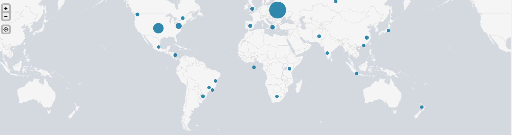

## Unit 19 Homework: Protecting VSI from Future Attacks

### Scenario

In the previous class,  you set up your SOC and monitored attacks from JobeCorp. Now, you will need to design mitigation strategies to protect VSI from future attacks. 

You are tasked with using your findings from the Master of SOC activity to answer questions about mitigation strategies.

### System Requirements 

You will be using the Splunk app located in the Ubuntu VM.

### Logs

Use the same log files you used during the Master of SOC activity:

- [Windows Logs](resources/windows_server_logs.csv)
- [Windows Attack Logs](resources/windows_server_attack_logs.csv)
- [Apache Webserver Logs](resources/apache_logs.txt	)
- [Apache Webserver Attack Logs](resources/apache_attack_logs.txt	)

---

### Part 1: Windows Server Attack

Note: This is a public-facing windows server that VSI employees access.
 
#### Question 1
- Several users were impacted during the attack on March 25th.
- Based on the attack signatures, what mitigations would you recommend to protect each user account? Provide global mitigations that the whole company can use and individual mitigations that are specific to each user.

> Answer

> 1) Creating a security rule to block all non-US based IP addresses. Application of this broad rulewill depend upon on whether or not there is significant coustomer base and whether or not the business will be significantly impacted with such broadscale blockage- For instance review of cluster map analysis indicates that there is less traffic from outside of the US

> 2) Creating a security rule that will limit access to know ip addresses within the network
  
#### Question 2
- VSI has insider information that JobeCorp attempted to target users by sending "Bad Logins" to lock out every user.
- What sort of mitigation could you use to protect against this?

> Answer

> Creating a security rule that would allow only a limied number of "failed logins". The user can be locked out for only a small period of time e-g 5 minutes with a progressive increase in time after more than 3 attempts. In addition we can also implement a 'challange-response" test where a user is prompted to type in a word or some simple activity to ensure its a person and not an automated brute force attempt

### Part 2: Apache Webserver Attack:

#### Question 1
- Based on the geographic map, recommend a firewall rule that the networking team should implement.
- Provide a "plain english" description of the rule.
  - For example: "Block all incoming HTTP traffic where the source IP comes from the city of Los Angeles."
- Provide a screen shot of the geographic map that justifies why you created this rule. 

>Answer:

> A Mitigation strategy would be to block all HTTP traffic from Ukraine e-g **`79.171.127.34`** was one of the suspicious IP addresses where this particular attack seems to have originated form. See the cluster map below. 

>**Evidence of the attack**
> On Analysis of the Routine Apache logs and the Apache Attack logs reval the following:

`source="apache_attack_logs.txt" host="Apache_Attack_logs" sourcetype="access_combined" |  top method`

- A significant increase in the POST requests from 106 to 1324 and a significant decrease in the GET requests from 9851 to 3157

`source="apache_attack_logs.txt" host="Apache_Attack_logs" sourcetype="access_combined" |  top status`

- A significant increase in the status of error (404) increasing from 213 (2%) to 679 (15%)

- `source="apache_attack_logs.txt" host="Apache_Attack_Logs" sourcetype="access_combined" | top method clientip`

- The Ip address associated with this disproportionate increase in POST requests is **`79.171.127.34`** which is likely from **`Ukraine`**

- `source="apache_attack_logs.txt" host="Apache_Attack_Logs" sourcetype="access_combined" | iplocation clientip |geostats count`

- The iplocation and the geolocation queries confirm this by have over 2000 enries from a country in Europe, likely in the region of Ukraine

  
#### Question 2

- VSI has insider information that JobeCorp will launch the same webserver attack but use a different IP each time in order to avoid being stopped by the rule you just created.

- What other rules can you create to protect VSI from attacks against your webserver?
  - Conceive of two more rules in "plain english". 
  - Hint: Look for other fields that indicate the attacker.

> Answer
> 1) Alternatively, since there is no significant reliance on foreign traffic, VSI can consider implementing even a broader policy of blocking all non-US/foreign web traffic with a few exceptions as needed

> 2) Creating a security rule to block a traffic with a significanly higher byte count that would be suspiscious for an attack

### Guidelines for your Submission:
  
In a word document, provide the following:
- Answers for all questions.
- Screenshots where indicated

Submit your findings in BootCampSpot!

---

© 2020 Trilogy Education Services, a 2U, Inc. brand. All Rights Reserved.
